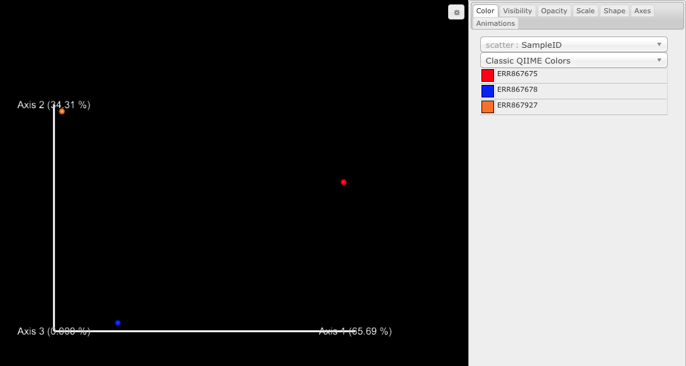
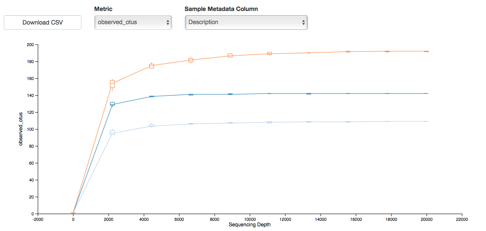

# EcoBioTec - QIIME2 tutorial
given by [**António Sousa**](https://antonioggsousa.github.io)

 

## Introduction

First of all you need to understand the data before start. Several considerations should be taken into account before the data analysis begin depending on the sequencing technology, library preparation/chemistry, and amplicon region chosen. This tutorial has the purpose to preprocess/filter, assign taxonomy, and explore diversity 
patterns of 16S rRNA amplicon sequencing data from Illumina MiSeq. To this end, we will carry out this tutorial with few samples (n=3) from the large campaign of [Ocean Sampling Day 2014](https://www.microb3.eu/events/workshops/ocean-sampling-day-2014.html) (henceforward **OSD14**). 

Processing sequence reads into comprehensive biological information consists in decreasing the level of complexity 
from these large datasets using high performance algorithms integrated in bioinformatics pipelines. 
The following steps are often neccessary to carry out (not necessarily by this order):

1. *demultiplex the raw amplicon libraries into samples based on barcodes/indexes sequences*; 
2. *join paired-end reads (only for Illumina)*;
3. *filter the reads based on quality (Phred) scores, length, homopolymers, etc*; 
4. *align reads for further quality control (optional)*; 
5. *merge equal/unique sequences (100%) - aka dereplication*; 
6. *detect and remove artificial sequences with multi parent origin produced during PCR amplification - aka chimeras*; 
7. *cluster unique sequences into operational taxonomic units (OTUs) based on user-defined threshold*; 

    * new algorithms/pipelines such as [DADA2](https://www.nature.com/articles/nmeth.3869) and [Deblur](http://msystems.asm.org/content/2/2/e00191-16) offer an alternative to the steps 2-7 and 3-7, respectively. Basically, DADA2 tries to eliminate any sequencing error based on Poisson probabilist distribution of each partition (unique reads), and Deblur removes this sequencing error through error profiles and Hamming distance between two sequences. Then, both remove chimeras. Unlike the above mentioned, the sequences are not clustered into OTUs, but instead kept as exact sequences. Therefore, these 'exact sequences' (aka 'amplicon sequence variants' (henceforward ASVs) or 'sub-OTUs') could diverge as little as 1 nucleotide. Please, for more details have a look into the papers (above links) and the respective tutorials/source codes: [DADA2](https://benjjneb.github.io/dada2/index.html) and [Deblur](https://github.com/biocore/deblur). In addition, read the paper of [Thompson et al., 2017](https://www.nature.com/articles/nature24621) to understand better the differences between OTUs-ASVs and their implications.

8. *classify taxonomically OTUs/ASVs using a non-redundant, reference database*.[adapted from 1](#fn1)

 

### Summary

Theoretical and practical introduction to:

+ [FastQC](http://www.bioinformatics.babraham.ac.uk/projects/fastqc/)
    
    + assess fastq feature-related information  

+ [QIIME2](https://qiime2.org) (Quantitative Insights Into Microbial Ecology 2)
    
    + upstream analysis 
        + prepocessing
        + chimera identification and exclusion
        + dereplication
        + denoising(ASVs)/clustering(OTUs) 
        + taxonomic classification
    
    + downstream analysis:
        + summarise taxonomic analysis
        + phylogenetic tree
        + alpha and beta diversity 

+ [PICRUSt](https://picrust.github.io/picrust/) (Phylogenetic Investigation of Communities by Reconstruction of Unobserved States) 

    + KEGG (Kyoto Encyclopedia of Genes and Genomes) database

    + COG (Cluster of Ortholog Genes) database

    + summarise the results at different levels (using QIIME2) 

 

**Note**: In practice, this tutorial should not take more than 10-15 min. running on a computer with 4 cores, and 8 Gb RAM memory.  

 

## Before getting started

### Install 
+ [**FastQC**](http://www.bioinformatics.babraham.ac.uk/projects/fastqc/) (click on it and follow 
the instructions)

+ [**QIIME2**](https://docs.qiime2.org/2018.2/install/) (click on it and follow 
the instructions)

+ [**PICRUSt**](https://picrust.github.io/picrust/install.html#install) (**optional**)

 

## Getting started

As mentioned before, this tutorial will rely on few samples (n=3) from the large campaign of [**OSD14**](https://www.microb3.eu/events/workshops/ocean-sampling-day-2014.html). The paired-end fastq files containing the 16S rRNA gene amplicon from Illumina MiSeq are publicly available at *European Nucleotide Archive* (**ENA**). In addition, this data was already processed through the [EBI Metagenomics](https://www.ebi.ac.uk/metagenomics/pipelines/4.1) pipeline and the results are publicly available which allows us to compare them (search for [**OSD**](https://www.ebi.ac.uk/metagenomics/projects/ERP009703)). Therefore, since **OSD14** includes shotgun metagenomics data, we can also compare the results from functional predictions based on 16S rRNA gene profiling through **PICRUSt**.  

 

#### FASTQ files

Start by creating your working directory. 

    mkdir EcoBioTec_NGS_tutorial # create the folder 'EcoBioTec_NGS_tutorial'
    
    cd EcoBioTec_NGS_tutorial/ # move your current directory to the 'EcoBioTec_NGS_tutorial'

Then, download the **fastq** data files from the [**ENA**](https://www.ebi.ac.uk/ena) repository for each **run accession** that appears in the first table below using **ftp** (file transfer protocol).

    ftp ftp.sra.ebi.ac.uk # connect to the EBI server
    
    Name: anonymous # user
    
    Password: name@e-mail # use your own e-mail
    
    cd vol1/fastq/ERR867/ERR867678 # change directory 
    
    get ERR867678_1.fastq.gz # the forward fastq file
    
    get ERR867678_2.fastq.gz # the reverse fastq file
    
    .
    .
    .
    
    bye # exit ftp

 

#### Metadata file

The metadata file, once called mapping file (in the previous version of QIIME), is a text 
file (in '.tsv' format - tab-separated values) that contains information about sequencing 
oligonucleotides used in our study, i.e., barcodes/indexes and primers, as well as 
environmental variables contextualizing the environment from where the samples were collected, 
i.e., lat/lon, concentration of nutrients, etc. This information will be important to demultiplex your samples based on barcodes, indexes; trim off your primeirs, etc. It is also possible to add information concerning 
some sample partition that could make sense for your own study. For example, imagine that you
have samples from patients infected by some pathogenic bacteria and other set of samples from
healthy patients. You can group your samples by healthy/infected. This information may be 
added to your metadata file and it will be very useful for downstream analysis.  

Now have a look into the table below.

 

| Sample | Run Accession | OSD identifier | Region |
|:-----------:|:------------:|:------------:|:------------:|
| ERS667589 | ERR867678 | OSD73_2014-06-21_1m_NPL022 | Viana do Castelo     
| ERS667588 | ERR867675 | OSD74_2014-06-21_1m_NPL022 | Porto
| ERS667554 | ERR867927 | OSD111_2014-06-21_0m_NPL022 | Aveiro   
 

The information above will be used to make our metadata file (below). 

 

Write down the following information in a text file and save it as **'osd14_metadata.tsv'**.

 

| #SampleID |   BarcodeSequence |   LinkerPrimerSequence |  Description
|:-----------:|:------------:|:------------:|:------------:|
| #q2:types |   categorical |   categorical | categorical 
| ERR867678 |   | |     OSD73_2014-06-21_1m_NPL022 |
| ERR867675 |   | |     OSD74_2014-06-21_1m_NPL022 |
| ERR867927 |   | |     OSD111_2014-06-21_0m_NPL022 |

 

Then create a folder (as indicated below), and move the file into it.

    mkdir metadata # create the folder

    mv osd14_metadata.tsv metadata/ # move the file into the folder

 

#### QIIME2

QIIME2 is installed under a conda environment. Let's check if it is available:

    conda info --envs # /Users/arenha/miniconda3/envs/qiime2-2018.4

Open it to get started!

    source activate qiime2-2018.4

 

First, you need to import your forward/reverse fastq files into QIIME2 compatible format (known as [QIIME2 artifact file](https://docs.qiime2.org/2018.2/concepts/) - '.**qza**' format). To do so, you need also to provide information about which type of sequencing files you are providing to **QIIME2** ([read about it](https://docs.qiime2.org/2018.2/tutorials/importing/)). 

The **OSD14** dataset used herein is composed by paired-end fastq files, already demultiplexed.  From the previous link, we will assume that our data fits under the **“Fastq manifest” formats**. 

You need to write down the information below and save it as **source_info.csv** (in '.**csv**' format).

* #paired-end PHRED 33 fastq manifest file for forward/reverse reads

|sample-id | absolute-filepath | direction
|:-----------:|:------------:|:------------:|
|ERR867678 | $PWD/fastq/ERR867678_1.fastq.gz | forward
|ERR867678 | $PWD/fastq/ERR867678_2.fastq.gz | reverse
|ERR867675 | $PWD/fastq/ERR867675_1.fastq.gz | forward
|ERR867675 | $PWD/fastq/ERR867675_2.fastq.gz | reverse
|ERR867927 | $PWD/fastq/ERR867927_1.fastq.gz | forward
|ERR867927 | $PWD/fastq/ERR867927_2.fastq.gz | forward

 

Type the following to import and convert **fastq** files to **QIIME2 artifact file** format:

    qiime tools import --type 'SampleData[PairedEndSequencesWithQuality]' --input-path source_info.csv --source-format PairedEndFastqManifestPhred33 --output-path demux-paired-end_OSD14.qza

 

There is also a different *QIIME artifact* file - '.**qzv**' - that will appear always that is generated a file, i.e., a table/plot, that can be vizualized.

To vizualize the files with '.**qzv**' format do the following  (*always whenever necessary*):

    qiime tools view your_file.qzv

On the other hand, if you want to export files from '.**qza**' format, do the following (*always whenever necessary*): 

    qiime tools export your_file.qza --output-dir your_output_dir

 

### Demultiplexing sequences
#### Q scores and no. reads

In this case, you do not need to demultiplex your sequences, but you need to check the quality of your sequences. For that propose, run the following:

    qiime demux summarize --i-data demux-paired-end_OSD14.qza --o-visualization demux-paired-end_OSD14.qzv

The plots produced by QIIME2 are in '*.qzv*' extension. To visualize the plots you need to run the next script (as it was mentioned above):

    qiime tools view demux-paired-end_OSD14.qzv

 

The distribution of fastq scores over the forward and reverse reads should look like this: 

 

You should also check the number of sequences per sample (below). In total the OSD14 dataset used herein holds 115 514 pair of reads. 

|   Sample name |   Sequence count
|:-----------:|:------------:|  
|   ERR867678   |   33 830
|   ERR867675   |   40 648
|   ERR867927   |   41 036

 

#### FastQC

Since **QIIME2** produces only weak statistics about **fastq** files (*of course the quality control of fastq files is not the aim of QIIME2!*), in addition to **QIIME2** we will use a different software, **FastQC** (*developed with the aim of control the quality of fastq data!*), developded for that purpose. 

**FastQC** is a java-based software to check, assess and control the quality of fastq data through multiple analysis given through plots for easier interpretation and decision (check the [manual](https://dnacore.missouri.edu/PDF/FastQC_Manual.pdf)). 

 

Run **FastQC** over each **fastq** file (forward and reverse; *do the same for all fastq.gz files*):

    /Applications/FastQC.app/Contents/MacOS/fastqc fastq/ERR867678_1.fastq.gz

    /Applications/FastQC.app/Contents/MacOS/fastqc fastq/ERR867678_2.fastq.gz

    .
    .
    .

Create the folder **fastqc**:

    mkdir fastqc

Move the **fastqc** *html* reports from **fastq** directory to the **fastqc** folder:

    mv fastq/*.zip fastq/*.html fastqc/

 

Open each **fastqc** *html* report created for each file to have a look into the statistics, like: no. of reads, Q scores per bp, etc. 

 

### Quality filtering and ASV table
#### DADA2

**DADA2** is a *Divisive Amplicon Denoising Algorithm* but at the same time is *per se* a pipeline, since it filters reads (based on length and Q scores) as well as chimeras; joins paired-end reads; denoises and dereplicates sequences (giving as output one **ASV table**). 

Run the **DADA2** algorithm/pipeline: 

    qiime dada2 denoise-paired --i-demultiplexed-seqs demux-paired-end_OSD14.qza --p-trunc-len-f 225 --p-trunc-len-r 225 --p-n-reads-learn 30000 --p-n-threads 4 --o-representative-sequences rep-seqs-dada2_OSD14.qza --o-table table-dada2_OSD14.qza --output-dir dada2-dmx-pe_OSD14

 

Basically, this **dada2** plugin takes the **fastq** files in *QIIME artifact* format - **'demux-paired-end_OSD14.qza'** - and outputs the following: representative sequences for each *ASV* - **'rep-seqs-dada2_OSD14.qza'** -, *ASV table* - **'table-dada2_OSD14.qza'** -, and some statistics - **'denoising_stats.qza'**.

 

The results produced above can be summarized and vizualized using the following plugins:

    qiime feature-table summarize --i-table table-dada2_OSD14.qza --o-visualization table-dada2_OSD14.qzv --m-sample-metadata-file metadata/osd14_metadata.tsv

    qiime tools view table-dada2_OSD14.qzv

    qiime feature-table tabulate-seqs --i-data rep-seqs-dada2_OSD14.qza --o-visualization rep-seqs-dada2_OSD14.qzv

    qiime tools view rep-seqs-dada2_OSD14.qzv

 

### Taxonomic assignment 

We already have the **ASV table** (with the frequency of occurrence of each *ASV* sequence) as well as **representative sequences** (for each *ASV*). 

Now, we will classify the **ASVs representative sequences** using the **Naive Bayes classifier**. As any other classifier, the accuracy of **Naive Bayes classifier** depends on training data, i.e., the 16S rRNA gene database. It has been proved that training only the hypervariable region targeted by the primers used in the study in question improves the accuracy of **Naive Bayes classifier**. 

For the purpose of this tutorial we will not train the classifier ([*see how to train the classifier!*](https://docs.qiime2.org/2018.4/tutorials/feature-classifier/)), but instead we will used a pretrained classifier (*although not totally recommend!*) - **Greengenes 13_8 99% OTUs full-length sequences**.   

First, download the Greengenes database and check their integrity (with **MD5 checksum**):

    wget -O "gg-13-8-99-classifier.qza" "https://data.qiime2.org/2018.4/common/gg-13-8-99-nb-classifier.qza"

    md5 gg-13-8-99-classifier.qza

If the result of **MD5 checksum** is the same as *MD5: bb72a9e3f1a4c810dd50bceef3508105*, it means that the database was properly downloaded (*in our case should give this: MD5 (gg-13-8-99-classifier.qza) = bb72a9e3f1a4c810dd50bceef3508105*).

**Note:** You should keep in mind that **Greengenes** is **not updated** since **May, 2013**. 

Then, classify the **ASVs representative sequences** with **Naives Bayes classifier**:

    qiime feature-classifier classify-sklearn --i-classifier gg-13-8-99-classifier.qza --i-reads rep-seqs-dada2_OSD14.qza --o-classification taxonomy-rep-seqs-dada2_OSD14.qza

Finally, get your **ASV table** with **taxonomy**:

    qiime metadata tabulate --m-input-file taxonomy-rep-seqs-dada2_OSD14.qza --o-visualization taxonomy-rep-seqs-dada2_OSD14.qzv 

    qiime tools view taxonomy-rep-seqs-dada2_OSD14.qzv

Get the prokaryotic profile (*barplot it!*):

    qiime taxa barplot --i-table table-dada2_OSD14.qza --i-taxonomy taxonomy-rep-seqs-dada2_OSD14.qza --m-metadata-file metadata/osd14_metadata.tsv --o-visualization taxa-bar-plots_OSD14.qzv

    qiime tools view taxa-bar-plots_OSD14.qzv

The profile at **phylum level** should look like this:

### Alpha and beta diversity
#### Phylogenetic tree

Several diversity metrics are based on phylogenetic methods requiring a phylogenetic tree. Therefore, for that purpose we will do a maximum-likelihood tree (ML).

First, you need to perform a multiple sequence alignment (MSA) with **MAFFT**:

    qiime alignment mafft --i-sequences rep-seqs-dada2_OSD14.qza --o-alignment mafft-rep-seqs-dada2_OSD14.qza

Then, eliminate the highly variable positions, to avoid overestimate distances:

    qiime alignment mask --i-alignment mafft-rep-seqs-dada2_OSD14.qza --o-masked-alignment masked-msa-rep-seqs-dada2_OSD14.qza

Finaly, build the ML tree with **FastTree**:

    qiime phylogeny fasttree --i-alignment masked-msa-rep-seqs-dada2_OSD14.qza --o-tree unroot-ml-tree-masked_OSD14.qza

Additionally, root your unrooted tree based on midpoint rooting method:

    qiime phylogeny midpoint-root --i-tree unroot-ml-tree-masked_OSD14.qza --o-rooted-tree root-ml-tree_OSD14.qza

 

#### Core diversity analysis

**QIIME** was built-in on *scripts* that perform several instructions in order to automatize routine tasks. **QIIME2** works in a similar manner but instead of *scripts* you have know the *plugins*. The **core diversity analysis** plugin is not an exception and therefore it performs several diversity metrics by default. 

An important consideration of every downstream analysis is the different number of sequences *per* sample that bias any estimation sensitive to sampling. Therefore, there is a comman approach (*not neccessarily the best one!*) to deal with this issue that is called **rarefaction**. **Rarefaction** is the proccess of subsample randomly each sample at even sampling depth (*normally to the sample with the lowest no. of reads!*). 

To have an ideia of which is the most proper no. of sequences to **subsample**, run the next plugin:

    qiime tools view table-dada2_OSD14.qzv

Then, run the **core diversity analysis** plugin choosing the **phylogenetic** pipeline:

    qiime diversity core-metrics-phylogenetic --i-phylogeny root-ml-tree_OSD14.qza --i-table table-dada2_OSD14.qza --p-sampling-depth 20000 --m-metadata-file metadata/osd14_metadata.tsv --output-dir core-metrics-results

 

#### Beta diversity
##### Unweighted UniFrac

**Unweighted UniFrac** allows to assess how the prokaryotic communities cluster together based on the branches shared between communities. 

Type the next plugin to have a look at **PCoA** built with the **Unweighted UniFrac** metric:

    qiime tools view core-metrics-results/unweighted_unifrac_emperor.qzv

It should look like this:

##### Weighted UniFrac

On the other hand, **Weighted UniFrac** allows to assess how the prokaryotic communities cluster together based on the weighted (*abundance of ASVs!*) branches shared between communities. 

Type the next plugin to have a look at **PCoA** built with the **Weighted UniFrac** metric:

    qiime tools view core-metrics-results/weighted_unifrac_emperor.qzv

It should look like this:

 

#### Alpha diversity
##### Rarefaction

**Rarefaction** is also used to assess if the *sequencing effort* was enough to catch all the diversity present within each sample. 

Run the following to see the rarefaction plots: 

    qiime diversity alpha-rarefaction --i-table table-dada2_OSD14.qza --i-phylogeny root-ml-tree_OSD14.qza --p-max-depth 20000 --m-metadata-file metadata/osd14_metadata.tsv --o-visualization alpha-rarefaction_OSD14.qzv

    qiime tools view alpha-rarefaction_OSD14.qzv

The **rarefaction curves** should look like this:

 

The curves of observed no. of ASVs *per* sample seem very flatted what is an indication of a enough **sequencing effort** to catch the diversity of these communities. 

 
 
 

## Metagenomic prediction based on 16S profiles
### PICRUSt

[**PICRUSt**](http://picrust.github.io/picrust/) is described in detail in [Langille et al., 2013](https://www.nature.com/articles/nbt.2676). 

 

### Before starting

**PICRUSt** requires an **OTU table** (*an not an ASV table!*) built with the **closed reference method**. Basically, the **closed reference method** compares each **OTU representative sequence** with the references sequences available in a given database; if the **OTU representative sequence** has high similarity with one reference sequence in the given database, this **OTU** is kept, otherwise it is discarded. Since **PICRUSt** was pretrained with **Greengenes database v.13.5**, the user should use this database as reference in **closed reference method**, or alternatively train the database used during the **closed reference method**.    

 

### Closed-reference method: pipeline
#### Join paired-end reads

    mkdir PICRUSt

    cd PICRUSt

    cp ../demux-paired-end_OSD14.qza .

    qiime vsearch join-pairs --i-demultiplexed-seqs demux-paired-end_OSD14.qza --p-allowmergestagger --o-joined-sequences dmx-jpe_OSD14.qza

#### Filter based on Q scores

    qiime quality-filter q-score-joined --i-demux dmx-jpe_OSD14.qza --o-filtered-sequences dmx-jpe-filter_OSD14.qza --o-filter-stats dmx-jpe-filter-stats.qza

#### Dereplicating sequences

    qiime vsearch dereplicate-sequences --i-sequences dmx-jpe-filter_OSD14.qza --o-dereplicated-table drpl-tbl_OSD14.qza --o-dereplicated-sequences drpl-seqs.qza

#### Closed-reference clustering

First download the ***Greengenes database v.13.5***:

    wget ftp://greengenes.microbio.me/greengenes_release/gg_13_5/gg_13_5_otus.tar.gz # download DB

    tar -xvzf gg_13_5_otus.tar.gz # uncompress DB

    qiime tools import --type 'FeatureData[Sequence]' --input-path gg_13_5_otus/rep_set/97_otus.fasta --output-path 97_otus-GG.qza # import fasta seqs

    qiime tools import --type 'FeatureData[Taxonomy]' --source-format HeaderlessTSVTaxonomyFormat --input-path gg_13_5_otus/taxonomy/97_otu_taxonomy.txt --output-path 97_otu-ref-taxonomy-GG.qza # import taxonomy

 

Then, do the **OTU clustering** at **97%**:

    qiime vsearch cluster-features-closed-reference --i-table drpl-tbl_OSD14.qza --i-sequences drpl-seqs.qza --i-reference-sequences 97_otus-GG.qza --p-perc-identity 0.97 --o-clustered-table tbl-cr-97_OSD14.qza --o-clustered-sequences rep-seqs-cr-97_OSD14.qza --o-unmatched-sequences unmatched-cr-97_OSD14.qza

 

Export the **OTU table**.

    qiime tools export tbl-cr-97_OSD14.qza --output-dir .

Inside the folder **tbl-cr-97_OSD14** is a **biom** file **feature-table.biom** (*the OTU table in biom format!*).

Convert to **json** format. 

    biom convert -i feature-table.biom -o feature-table.json.biom --to-json

Now, we will use the [**Galaxy**](http://huttenhower.sph.harvard.edu/galaxy/) version of **PICRUSt** (*then follow the instructions!*).

Finalize this tutorial with a simple barplot with the predictions of functional metagenomic content. 

 

### Scripts
#### Normalize 16S rRNA gene copy numbers in PICRUSt

    normalize_by_copy_number.py -i feature-table.biom -o normalized_feature-table.biom

#### Predict the metagenome using the normalized OTU table produced before
    predict_metagenomes.py -f -i normalized_feature-table.biom -o kegg_metagenome_predictions.tab

 
 
 
 

## Disclaimer 

All the data used herein was made public elsewhere (proper links were provided along the tutorial). This tutorial was based on others publicly available on **QIIME2** official website. The results generated have just the general purpose to give a brief introduction to the analysis of 16S amplicon NGS data with **QIIME2** and functional prediciton with **PICRUSt**. 

 

 

 

<a name="fn1">1</a>: Gaspar Gonçalves de Sousa, A. (2017). Arctic microbiome and N-functions during the winter-spring transition. Masters Dissertation. 